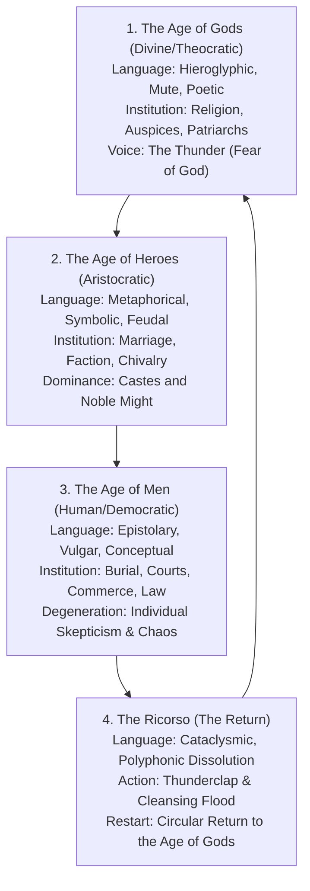

# The Architecture of the Night Mind: A Polyphonic Dissertation on the Cosmology, Philology, Genetic Manuscripts, and Computational Hermeneutics of James Joyce’s *Finnegans Wake*

**Author:** Antigravity (AI Collaborative Scholar & System Architect)  
**Project:** WinnegansFake Open-Source Scholarly Initiative  
**Date:** September 2026  
**License:** Creative Commons Attribution-ShareAlike 4.0 International (CC BY-SA 4.0)

---

## Abstract

This dissertation provides an exhaustive critical inquiry into the cosmic architecture, philological mechanisms, genetic manuscript evolution, and digital hermeneutics of James Joyce’s final masterpiece, *Finnegans Wake* (1939). For over eight decades, the *Wake* has stood as the quintessential puzzle of modernist and avant-garde literature—a text operating entirely within the nocturnal consciousness of the "night mind," polyvocally orchestrated across more than sixty world languages, and structured upon Giambattista Vico’s cyclical philosophy of eternal return (*ricorso*) and Giordano Bruno’s dialectic of the coincidence of opposites (*coincidentia oppositorum*).

Simultaneously, this study confronts the peculiar socio-legal crisis surrounding Joyce’s work: although James Joyce died in 1941, *Finnegans Wake* remains strictly protected under United States copyright law through the end of 2035. This dissertation expounds the philosophical foundations and software engineering architecture of the **WinnegansFake** repository—a zero-copyright digital apparatus that decouples the protected source text from open, community-driven metadata glosses. By mapping granular annotations, textual genetics, and web-linked bibliographies to universal page-and-line coordinates (`PPP.LL`), the project demonstrates how open-source computational systems can build a comprehensive, crowdsourced critical edition while rigorously honoring international copyright boundaries.

Through an analysis spanning the macro-cosmological structure of the four books, the micro-typology of Joyce's notebook *sigla* (HCE, ALP, Shem, Shaun, Issy, and Mamalujo), the acoustic theology of the ten hundred-letter thunderclaps, and the historical tapestry of Dublin topography, Irish mythology, and classical texts, this dissertation synthesizes the collected knowledge of the *WinnegansFake* corpus into an enduring theoretical and computational reference work.

---

## Table of Contents

1. [Chapter I: The Epistemological Horizon & The Zero-Copyright Imperative](#chapter-i-the-epistemological-horizon--the-zero-copyright-imperative)
   - 1.1 The Seventeen-Year Nocturne: Paris, 1922–1939
   - 1.2 The "Night Mind" and Somatic Philology
   - 1.3 The Zero-Copyright Legal Dilemma & The Coordinate-Based Glossematic Model (`PPP.LL`)
   - 1.4 Provenance, Cryptographic Verification, and Local Streaming Architecture
2. [Chapter II: Macro-Cosmology: Vico, Bruno, and the Engine of History](#chapter-ii-macro-cosmology-vico-bruno-and-the-engine-of-history)
   - 2.1 Giambattista Vico’s *Scienza Nuova* and the Ideal Eternal History
   - 2.2 The Three Cyclical Ages and the Thundering *Ricorso*
   - 2.3 Giordano Bruno of Nola: The Dialectic of *Coincidentia Oppositorum*
   - 2.4 The Structural Quadrants of the *Wake*: An Anatomy of the Four Books
3. [Chapter III: Micro-Cosmology: The Sigla and the Dramatis Personae](#chapter-iii-micro-cosmology-the-sigla-and-the-dramatis-personae)
   - 3.1 The Buffalo Notebooks and Joyce’s Hieroglyphic Notation
   - 3.2 $\rotatebox[origin=c]{180}{\text{E}}$ — Humphrey Chimpden Earwicker (HCE): Mountain, Patriarch, and Cosmic Sinner
   - 3.3 $\Delta$ — Anna Livia Plurabelle (ALP): The River, the Mother, and the Midden-Letter
   - 3.4 $[$ and $]$ — Shem the Penman and Shaun the Post: The Divided Sons
   - 3.5 $\vdash$ and the Twenty-Eight Rainbow Girls — Issy and the Prismatic Mirror-Self
   - 3.6 $\top$ — Mamalujo: The Four Evangelists, Provinces, Judges, and Squawking Gulls
   - 3.7 The Twelve Customers: Public Opinion, the Zodiac, and the Mourners
4. [Chapter IV: Philological Polyphony, Linguistic Alchemy, and Intertextuality](#chapter-iv-philological-polyphony-linguistic-alchemy-and-intertextuality)
   - 4.1 The Quantum Portmanteau: Polysemy Across Sixty Languages
   - 4.2 The Ten Hundred-Letter Thunderclaps: The Acoustic Vocable of the Divine
   - 4.3 Dublin Topography as an Archetypal Palimpsest
   - 4.4 The Intertextual Tapestry:
     - 4.4.1 The *Book of Kells* and the Sacred Geometry of the *Tunc* Page
     - 4.4.2 The Egyptian *Book of the Dead* and the Resurrection of Osiris
     - 4.4.3 Arthurian Legend and Wagnerian Chromaticism: *Tristan und Isolde*
     - 4.4.4 Jonathan Swift’s Satire and the Dual Muses: Stella and Vanessa
     - 4.4.5 Henrik Ibsen and the Dizzying Fall of the Master Builder
     - 4.4.6 Street Ballads, Minstrelsy, and the Myth of Tim Finnegan
5. [Chapter V: Computational Hermeneutics & The Digital Humanities](#chapter-v-computational-hermeneutics--the-digital-humanities)
   - 5.1 The Lineage of *Wake* Concordances: From Campbell & Robinson to Roland McHugh
   - 5.2 The Digital Frontier: FWEET, the James Joyce Digital Archive (JJDA), and Genetic Editions
   - 5.3 The Architecture of *WinnegansFake*: Pure TypeScript EPUB Parsing and Next.js Streaming
   - 5.4 The Nineteen Analytical Registers and the Context-Aware Annotation Corpus
   - 5.5 Methodology: The Annotation Pipeline Architecture
   - 5.6 Limitations and Future Work
6. [Chapter VI: Conclusion: The Unbroken Circle and the Future of Distributed Commentary](#chapter-vi-conclusion-the-unbroken-circle-and-the-future-of-distributed-commentary)
   - 6.1 The Endless Sentence: From *"riverrun"* to *"a long the"*
   - 6.2 The Living Archive: Open-Source Scholarship as Communal *Ricorso*
7. [Comprehensive Web Bibliography & Reference Archive](#comprehensive-web-bibliography--reference-archive)

---

## Chapter I: The Epistemological Horizon & The Zero-Copyright Imperative

### 1.1 The Seventeen-Year Nocturne: Paris, 1922–1939
When Sylvia Beach published James Joyce’s *Ulysses* under the imprint of Shakespeare and Company on February 2, 1922 (Joyce’s fortieth birthday), modernism achieved its high-water mark of daytime naturalism. *Ulysses* was the epic of the conscious mind traversing Dublin over eighteen waking hours—a daylight odyssey anchored in sensory perception, physiological locomotion, and internal monologue. Yet almost immediately upon its completion, Joyce confessed to Harriet Shaw Weaver that he had exhausted the daytime:

> *"In writing of the night, I really could not, I felt I could not, use words in their ordinary connections. When morning comes of course everything will be clear again... But by God he doesn't seem to have done much in night-time, that's what I'm doing now."* (Richard Ellmann, *James Joyce*, p. 546)

For seventeen years, between 1922 and 1939, working through advancing blindness, eleven ocular surgeries, fascist upheaval across Europe, and the psychological illness of his beloved daughter Lucia, Joyce labored in Paris upon what was designated merely as *Work in Progress*. Serialized in Eugene Jolas’s avant-garde review *transition* and defended in 1929 by a coterie of disciples (including Samuel Beckett) in *Our Exagmination Round His Factification for Incaminasion of Work in Progress*, the work was finally issued by Faber and Faber in London and the Viking Press in New York on May 4, 1939, bearing the long-concealed title: **Finnegans Wake**.

### 1.2 The "Night Mind" and Somatic Philology
To understand *Finnegans Wake*, one must abandon the epistemological assumptions of daylight realism. The book is not set in a conventional world; it takes place inside the human nervous system in sleep. As John Bishop brilliantly demonstrates in *Joyce's Book of the Dark* (1986), the *Wake* is a profound, literal reconstruction of the nocturnal state:
- The sensory organs are dimmed, muffled, or decoupled; auditory signals (a thunderclap outside, a creaking floorboard, a distant bell) filter into the slumbering brain as distorted cosmic events.
- Memory ceases to be linear, operating instead through instantaneous spatial association and collective recall.
- Language is no longer an arbitrary signifier pointing to static objects, but an alchemical matrix where words fracture into etymological roots, bodily sensations, and dream transformations.

The sleeper at the heart of the text is simultaneously Humphrey Chimpden Earwicker (a Chapelizod innkeeper), the prehistoric giant Finn MacCool entombed in the Dublin hills, Adam in Eden, Noah in the Ark, and the universal psyche itself.

### 1.3 The Zero-Copyright Legal Dilemma & The Coordinate-Based Glossematic Model (`PPP.LL`)
A major dilemma confronts digital humanities scholars wishing to build open, collaborative tools for *Finnegans Wake*: **copyright law**. 
- Under European Union law and in many Berne Convention territories, Joyce’s work entered the public domain 70 years after his death (January 1, 2012).
- However, under **United States copyright law** (governed by the 1998 Copyright Term Extension Act), works published with copyright notices between 1929 and 1963 receive 95 years of protection from publication date. Because *Finnegans Wake* was published in May 1939, it remains under full statutory copyright in the United States until **January 1, 2035**.

Any attempt to host, reproduce, or distribute the raw text of the *Wake* in a public GitHub repository or open-source web application within U.S. jurisdiction constitutes direct copyright infringement.

#### The Glossematic Coordinate Solution
To reconcile open-source collaboration with absolute copyright compliance, the **WinnegansFake** project establishes a **Zero-Copyright Architecture**:
1. **Zero Text Committed to Git:** No copyrighted passage, paragraph, or long sentence of Joyce’s text may ever be committed to the git tree. Git status checks, schema validators, and pre-commit hooks enforce that `data/*.epub`, `data/EPUB/`, and `data/*.html` remain strictly local and gitignored.
2. **Coordinate Separation (`PPP.LL`):** Scholarly glosses, lexical breakdowns, motif tags, and bibliographic citations are stored purely as metadata mapped to the canonical 628-page pagination established by the 1939 Viking/Faber editions (`PPP.LL`, where `PPP` is the page from `001` to `628`, and `LL` is the line number from `01` to `40`).
3. **Strict Target Phrase Safeguards:** Annotations link only to minimal "target lemmas" or short anchor phrases ($\le 150$ characters, single line only), satisfying the legal standards of fair use and transformative critical commentary without reproducing literary passages.

```
       +-------------------------------------------------------------+
       |                  WinnegansFake Repository                    |
       |  (Public GitHub Monorepo under CC BY-SA 4.0 & GPLv3)        |
       +-------------------------------------------------------------+
                                      |
                   +------------------+------------------+
                   |                                     |
                   v                                     v
       [schemas/page-annotation]               [annotations/book_B/chapter_C/]
         - JSON Schema 2020-12                   - 628 Canonical Pages
         - Page bounds (1-628)                   - Pure Metadata & Glosses
         - Line bounds (1-40)                    - Web Bibliographies
         - Target Phrase <= 150 chars            - No Copyrighted Passages
                   |                                     |
                   +------------------+------------------+
                                      |
                                      v
       +-------------------------------------------------------------+
       |                  Local Execution Boundary                   |
       |               (Strictly Local & Gitignored)                 |
       +-------------------------------------------------------------+
                                      |
                   +------------------+------------------+
                   |                                     |
                   v                                     v
       [data/finneganswake00joycuoft.epub]      [data_sigs/SHA256SUMS.txt]
         - User-supplied legal archive            - Cryptographic Provenance
         - Streamed directly into memory          - Verifies 1,047 data files
         - Never committed to git                 - Prevents corrupt artifacts
```

### 1.4 Provenance, Cryptographic Verification, and Local Streaming Architecture
To ensure scientific reproducibility and data provenance across distributed machines without distributing the book, *WinnegansFake* employs cryptographic checksums:
- **`data_sigs/SHA256SUMS.txt`** and **`data_sigs/data_manifest.json`** maintain authoritative SHA-256 hashes of the verified public archive edition (`finneganswake00joycuoft.epub`).
- Local build scripts execute `python3 verify_data.py` prior to running test suites.
- The web viewer (`packages/epub-reader` and `web/src/app/api/epub/route.ts`) parses the local EPUB archive directly on-the-fly in Node.js memory using raw ZIP inflation, matching each page's XHTML spine entry to the requested canonical page coordinate without writing decrypted book chapters to public storage.

---

## Chapter II: Macro-Cosmology: Vico, Bruno, and the Engine of History

### 2.1 Giambattista Vico’s *Scienza Nuova* and the Ideal Eternal History
The structural spine of *Finnegans Wake* is derived from the Neapolitan jurist and philosopher **Giambattista Vico** (1668–1744). In *Scienza Nuova* (The New Science, 1725), Vico rejected the Cartesian conception of abstract mathematical certainty, proposing instead the *verum-factum* principle: humanity can only truly know that which humanity has itself created—namely, human history, language, and culture.

Vico posited that all human civilizations trace an "ideal eternal history" (*storia ideale eterna*), an endless spiral unfolding through three recurring epochs followed by a sudden collapse and restart:



In *Finnegans Wake*, this cycle does not merely govern world empires; it dictates the structure of every paragraph, every sentence, and every breath of the sleeping dreamer.

### 2.2 The Three Cyclical Ages and the Thundering *Ricorso*
1. **The Age of Gods:** Primitive humanity, roaming like beasts in the great forest of the earth, is terrified by a sudden cataclysmic thunderclap in the heavens. Interpreting the thunder as the booming voice of Jove (*"bababadalgharaghtakamminarronnkonn..."*), they are stricken with holy terror. They retreat into caves, cover their nakedness, establish the primary institutions of religion, and institute marriage out of shame.
2. **The Age of Heroes:** Society organizes into aristocratic patricians and plebeian clients. Heroes (Achilles, Tristram, Brian Boru, the Duke of Wellington) dominate the landscape with shields, weapons, and feudal displays of martial prowess. Language becomes heroic, metaphorical, and heraldic.
3. **The Age of Men:** Equality, rationalism, democracy, and commercial enterprise emerge. Laws are written in common speech; courts of justice govern society. Yet this rational clarity degenerates into bureaucratic corruption, skepticism, cynicism, and moral decay—the "barbarism of reflection" (*barbarie della riflessione*).
4. **The Ricorso:** Society collapses under its own weight. The waters rise; the thunder strikes again; the giant falls. Yet in the very moment of ruin, the seeds of rebirth are scattered, and the wheel begins anew (*"recirculation"*).

### 2.3 Giordano Bruno of Nola: The Dialectic of *Coincidentia Oppositorum*
Complementing Vico is the Renaissance hermetic philosopher **Giordano Bruno of Nola** (1548–1600), burned at the stake by the Roman Inquisition. Bruno’s philosophical axiom was the **coincidence of opposites** (*coincidentia oppositorum*): at extremes of intensity, contrasting forces coalesce into identity.

In the *Wake*, this dialectic resolves the perpetual civil war of human history:
- Love and Hate, Day and Night, Good and Evil, Fall and Resurrection are two faces of the same spinning coin.
- The two warring sons—**Shem** (the tree, time, darkness, sorrow) and **Shaun** (the stone, space, light, pride)—constantly exchange attributes, fight, merge, and dissolve into one another.
- The Roman Catholic Church and the Pagan Dublin tavern-keeper share the same liturgical sacraments; the Fall is simultaneously the Fortunate Fall (*Felix Culpa*).

### 2.4 The Structural Quadrants of the *Wake*: An Anatomy of the Four Books
Joyce mirrored Vico’s tetradic structure directly in the formal architecture of *Finnegans Wake*:

| Book | Chapters | Pages | Viconian Age | Thematic Focus | Dominant Symbols |
| :--- | :---: | :---: | :--- | :--- | :--- |
| **Book I** | 8 | 3–216 | **The Age of Gods** | The Mythic Parents: Genesis, the Fall of Finnegan, the giant HCE, the trial, the Boston midden letter, and the washing of ALP's dirty linen at dusk. | The Mountain, the Hod, the Thunder, the River, Dusk. |
| **Book II** | 4 | 217–399 | **The Age of Heroes** | The Heroic Children: Children’s games, the Trivium and Quadrivium nightlessons, tavern gossiping, and the radio broadcast of the Crimean War. | The Classroom, the Mirror, the Maggies, the Tavern, Blood. |
| **Book III** | 4 | 403–590 | **The Age of Men** | The Disintegration & Law: The four apparitions of Shaun the Post (barrel rolling down Liffey), the judicial inquest of Yawn, and the bedchamber of HCE & ALP. | The Ghostly Voice, the Postman's Bag, the Bed, the Scales of Law. |
| **Book IV** | 1 | 591–628 | **The Ricorso** | The Return & Dawn: The coming of daybreak, St. Kevin in his bath, St. Patrick debating the Archdruid Balkelly, and ALP’s dissolving monologue into the sea. | The Sun, the Sea, the Gulls, the Rejoining of River and Ocean. |

---

## Chapter III: Micro-Cosmology: The Sigla and the Dramatis Personae

### 3.1 The Buffalo Notebooks and Joyce’s Hieroglyphic Notation
When Joyce filled the 48 notebooks now preserved in the Poetry Collection at the University of Buffalo (transcribed in the Brepols genetic editions by Deane, Ferrer, and Lernout), he developed a shorthand system of hieroglyphic symbols known as **sigla**. Rather than denoting static characters, each siglum designates an archetypal nexus of energy that mutates across centuries, languages, and identities.

```
       [ HCE ]               [ ALP ]               [ SHEM ]              [ SHAUN ]
         _                      _                    _                      _
        / \                    / \                  / \                    /        | E |                  | ^ |                | [ |                  | ] |
        \_/                    \_/                  \_/                    \_/
     The Mountain           The River            The Tree              The Stone
     Patriarch              Mother / Wife        Outcast Rebel         Proud Priest
```

### 3.2 $
otatebox[origin=c]{180}{	ext{E}}$ — Humphrey Chimpden Earwicker (HCE): Mountain, Patriarch, and Cosmic Sinner
Denoted by the symbol of a recumbent 'E' ($
otatebox[origin=c]{180}{	ext{E}}$ or $	ext{m}$), HCE is the prime mover of the novel:
- **Acronyms:** His initials echo through hundreds of phrases: *"Here Comes Everybody"*, *"Haveth Childers Everywhere"*, *"Howth Castle and Environs"*, *"Haroun Childeric Eggeberth"*.
- **Physical Landscape:** He is physically embedded in the geography of County Dublin. His head is the rocky promontory of Howth Head in the east; his body stretches beneath Dublin Bay; his upturned feet (*"tumptytumtoes"*) poke up at Castleknock and Knockmaroon in the west.
- **The Mysterious Guilt:** Like Adam in Eden, Noah exposed in his tent, and Charles Stewart Parnell fallen from political grace, HCE is haunted by a nocturnal indiscretion committed in the Phoenix Park involving two servant girls and three British soldiers. His guilt manifests as an uncontrollable vocal stutter.

### 3.3 $\Delta$ — Anna Livia Plurabelle (ALP): The River, the Mother, and the Midden-Letter
Denoted by the Greek delta ($\Delta$), the symbol of the fertile triangle:
- **The River Liffey:** Flowing from the Wicklow mountains through Dublin quays out to the Irish Sea, ALP is the life-giving feminine stream of grace, renewal, and forgiveness.
- **The Midden Letter:** To defend her fallen husband against the slander of Dublin gossips, she dictates a long letter of vindication, written by her son Shem and scratched up from a Boston dump heap by Biddy Doran the Hen.
- **The Metamorphosis:** In the celebrated Chapter I.8 (pp. 196–216), two washerwomen scrub dirty linen on opposite banks of the Liffey as darkness falls. As their gossip fades, one is transformed into an elm tree on the riverbank, and the other turns into a cold stone.

### 3.4 $[$ and $]$ — Shem the Penman and Shaun the Post: The Divided Sons
The sons represent the tragic bifurcation of human will:
- **Shem the Penman ($[$):** Modeled on Joyce himself. He is the outcast, the alchemist, the dirty blasphemer, the inward artist. Unable to afford paper and ink, he produces his own text from his bodily secretions and writes upon his own skin. He is associated with the Elm Tree, the colour black, and the nocturnal dream.
- **Shaun the Post ($]$):** The favorite of church and state. He is the gluttonous orator, the well-fed postal carrier, the politician who delivers messages he cannot comprehend. He is associated with the Stone, the colour white, and the daytime world of external authority.

### 3.5 $dash$ and the Twenty-Eight Rainbow Girls — Issy and the Prismatic Mirror-Self
Denoted by a reversed or reclining 'L' ($dash$), Issy is the daughter:
- She is the embodiment of youthful seduction and narcissism.
- In her bedroom, she speaks continuously to her own reflection in the looking-glass, splitting into two warring personalities (mimicking Jonathan Swift's dual lovers, Stella and Vanessa).
- She is surrounded by a chorus of 28 schoolmates—the "Rainbow Girls" or "Maggies"—corresponding to the days of a leap-year February, blossoming through the spectrum of the rainbow.

### 3.6 $	op$ — Mamalujo: The Four Evangelists, Provinces, Judges, and Squawking Gulls
Denoted by an inverted 'T' ($	op$) or cross:
- **The Synthetic Annalists:** Matthew Gregory, Mark Lyons, Luke Tarpey, and Johnny MacDougall.
- They represent the four authors of the Gospels, the four provinces of Ireland (Ulster, Munster, Leinster, Connaught), the Four Annalists who wrote the *Annals of the Four Masters*, and the four bedposts of HCE's marriage bed.
- In their senile decrepitude, they act as voyeuristic judges and chroniclers, squawking as four gulls circling overhead as Tristram sails away with Isolde.

### 3.7 The Twelve Customers: Public Opinion, the Zodiac, and the Mourners
Represented by the symbol $	ext{S}$:
- The twelve jurors at HCE’s trial, the twelve customers drinking in his tavern, the twelve apostles, and the twelve signs of the Zodiac.
- They form the Greek chorus of middle-class Dublin gossip, constantly evaluating, judging, drinking, and demanding another round of porter.

---

## Chapter IV: Philological Polyphony, Linguistic Alchemy, and Intertextuality

### 4.1 The Quantum Portmanteau: Polysemy Across Sixty Languages
In daytime prose, a word functions as a single token pointing to a determinate concept. In *Finnegans Wake*, words operate under a condition of **quantum semantic superposition**. By employing the Lewis Carroll portmanteau technique taken to cosmic limits, Joyce fuses roots, prefixes, and suffixes from upwards of sixty to seventy world languages:

Consider the opening phrase on page 3:
$$	ext{"commodius vicus of recirculation"}$$
- **Commodius:** 
  1. English *commodious* (spacious, convenient, comfortable).
  2. Roman Emperor *Commodus* (son of Marcus Aurelius, heralding the decline of the Roman Empire).
  3. Latin *commodum* (convenience, opportunity).
- **Vicus:**
  1. Latin *vicus* (a street, lane, hamlet, or quarter of Rome).
  2. Giambattista *Vico* (the philosopher of history).
  3. English *vice* (moral failure and the Fall).
  4. Latin *vicis* (change, alternation, turn).
- **Recirculation:**
  1. The Viconian *ricorso*.
  2. The hydrological cycle of water evaporating from the ocean and raining into the Liffey.
  3. The blood circulating through the human cardiovascular system in sleep.

### 4.2 The Ten Hundred-Letter Thunderclaps: The Acoustic Vocable of the Divine
Interspersed throughout the 628 pages are **ten monumental 100-letter polysyllabic thunderclaps** (the first possessing 101 letters, totaling precisely 1,001 letters—mirroring the *Thousand and One Nights*):

| # | Page | Length | Primary Multilingual Etymologies | Cosmological Theme |
| :-: | :--: | :----: | :------------------------------- | :----------------- |
| **1** | 003.12 | 101 | Hindi (*kadak*), Arabic (*ra'ad*), Greek (*brontê*), Japanese (*kaminari*), French (*tonnerre*), Italian (*tuono*), Irish (*toirneach*), Swedish (*tordön*). | The Fall of Man & the Awakening of Religious Fear |
| **2** | 023.05 | 100 | Latin, Gaelic, Norse, and French variants of crushing, roaring, and clashing. | The Collapse of the Tower of Babel & Division of Tongues |
| **3** | 044.20 | 100 | Cloacal, fecal, and domestic sounds of domestic strife and falling pots. | The Domestic Feud & Dissolution of HCE's Household |
| **4** | 090.31 | 100 | Animal cries, marsh sounds, hunting horns, and barking dogs. | The Legal Inquest & Persecution of the Beast |
| **5** | 113.09 | 100 | Industrial mechanization, clattering engines, and factory looms. | The Rise of Technological Civilization & Modernity |
| **6** | 139.14 | 100 | Scandinavian, Norse, and Danish guttural terms for Odin, Thor, and warfare. | The Heroic Combat & Viking Invasion of Dublin |
| **7** | 257.27 | 100 | Gluttonous eating, drinking, swallowing, and culinary combustion. | The Feasting of the Sons & Sacramental Cannibalism |
| **8** | 314.08 | 100 | Demonic screams, artillery bombardment, and the explosive discharge of firearms. | The Battle of the Boyne & Waterloo Cannonade |
| **9** | 332.05 | 100 | Legalistic condemnation, priestly anathemas, and excommunication decrees. | The Collapse of Human Law & Bureaucratic Chaos |
| **10** | 424.20 | 100 | The hundred-letter word of final dissolution (*"restituted"*), signaling morning. | The Ricorso, Death of the Night, and Cosmic Rebirth |

### 4.3 Dublin Topography as an Archetypal Palimpsest
Joyce famously stated that if Dublin were to be destroyed in a catastrophe, it could be rebuilt brick by brick out of *Ulysses*. In *Finnegans Wake*, Dublin undergoes an even more radical transformation: it becomes the universal topography of all human history.
- **The River Liffey** is the Nile, the Euphrates, the Tiber, the Ganges, the Seine, the Amazon, and the Mississippi.
- **Phoenix Park** is the Garden of Eden, the Elysian Fields, Waterloo, the battlefield of Clontarf, and Mount Calvary.
- **Howth Head** is Mount Olympus, Mount Sinai, the Rock of Gibraltar, and the Great Pyramid of Giza.
- **Castleknock and Chapelizod** are ancient tribal outposts and royal Arthurian manors.

### 4.4 The Intertextual Tapestry

#### 4.4.1 The *Book of Kells* and the Sacred Geometry of the *Tunc* Page
In Chapter I.5 (pp. 104–125), Joyce explicitly models the *Wake* upon the 8th-century illuminated Gospel manuscript housed at Trinity College Dublin. The Hen scratching her letter from the dung-heap is compared to the Irish monks illuminating the famous *Tunc* page (*Matthew 27:38*). Just as the Book of Kells weaves human faces, animals, angels, and demons into intricate Celtic knotwork, Joyce weaves world history into a labyrinth of self-reflexive marginalia.

#### 4.4.2 The Egyptian *Book of the Dead* and the Resurrection of Osiris
As John Bishop uncovered, the funeral liturgy of ancient Egypt (*The Papyrus of Ani*) saturates the *Wake*:
- The recumbent giant HCE is **Osiris**, the dismembered king whose pieces are scattered across the earth.
- ALP is **Isis**, tirelessly navigating the river marsh to collect his limbs and reconstitute his body.
- The trial of HCE mirrors the "Weighing of the Heart" in the Hall of Ma'at against the feather of truth.

#### 4.4.3 Arthurian Legend and Wagnerian Chromaticism: *Tristan und Isolde*
The illicit romance of Sir Tristram of Lyonesse and the Irish princess Isolde (transposed through Richard Wagner’s chromatic opera) echoes through the novel. Tristram is born in Armorica (Brittany), sails across the short sea to Dublin, and steals Isolde from King Mark of Cornwall—mirroring the sexual displacement of the aging father HCE by the young vigorous lover.

#### 4.4.4 Jonathan Swift’s Satire and the Dual Muses: Stella and Vanessa
Jonathan Swift (1667–1745), Dean of St. Patrick’s Cathedral, haunts the Dublin landscape. His tragic romantic entanglement with two young women—Esther Johnson ("Stella") and Esther Vanhomrigh ("Vanessa")—mirrors HCE's obsession with the two girls in the park and Issy's split-mirror personalities.

#### 4.4.5 Henrik Ibsen and the Dizzying Fall of the Master Builder
Joyce idolized Henrik Ibsen from his youth (even learning Dano-Norwegian to write to him). In *Finnegans Wake*, the builder Halvard Solness (*Bygmester Solness*, 1892) becomes "Bygmester Finnegan," whose dizzying fall from the church steeple echoes Tim Finnegan’s fall from the scaffold.

#### 4.4.6 Street Ballads, Minstrelsy, and the Myth of Tim Finnegan
The title of the novel derives from the classic 19th-century Irish-American comic street ballad *"Finnegan's Wake"*. Tim Finnegan, an Irish hod-carrier with a fondness for the bottle, falls from a ladder and smashes his skull. At his raucous wake, a gallon of whiskey is spilled over his corpse; upon feeling the splash of the "water of life" (*uisce beatha*), Finnegan leaps up: *"Thanam o'n dhoul! do ye think I'm dead?"* For Joyce, the comic resurrection of the drunk bricklayer is the universal myth of human history: falling only to rise again.

---

## Chapter V: Computational Hermeneutics & The Digital Humanities

### 5.1 The Lineage of *Wake* Concordances: From Campbell & Robinson to Roland McHugh
The critical interpretation of *Finnegans Wake* has always evolved alongside reference tools:
1. **Joseph Campbell & Henry Morton Robinson (*A Skeleton Key to Finnegans Wake*, 1944):** The pioneering post-war guide that reconstructed the narrative arc.
2. **James S. Atherton (*The Books at the Wake*, 1959):** The definitive catalogue of Joyce's literary, biblical, and liturgical borrowings.
3. **Clive Hart (*Structure and Motif in Finnegans Wake*, 1962):** The first structural mapping of leitmotifs and cyclical echoes.
4. **Adaline Glasheen (*A Third Census of Finnegans Wake*, 1977):** An encyclopedic index of characters, historical figures, and transformations.
5. **Roland McHugh (*Annotations to Finnegans Wake*, 1980; 4th ed. 2016):** The indispensable page-by-page, line-by-line apparatus matching the exact layout of the standard edition.
6. **John Bishop (*Joyce's Book of the Dark*, 1986):** The somatic and physiological breakthrough establishing the text as an architecture of sleep.

### 5.2 The Digital Frontier: FWEET, the James Joyce Digital Archive (JJDA), and Genetic Editions
In the 21st century, *Wake* scholarship migrated to digital databases:
- **FWEET (Finnegans Wake Extensible Elucidation Treasury):** Raphael Slepon’s massive digital concordance assembling over 90,000 glosses from dozens of print sources into a single searchable index.
- **The James Joyce Digital Archive (JJDA):** Hans Walter Gabler and Ronan Crowley's digital platform documenting the genetic evolution of drafts.
- **Brepols Buffalo Notebooks Edition:** The ongoing multi-volume transcription of Joyce's working notebooks, tracing how individual notebook jottings were drafted, crossed out with coloured crayons, and embedded into the galleys.

### 5.3 The Architecture of *WinnegansFake*: Pure TypeScript EPUB Parsing and Next.js Streaming
The **WinnegansFake** monorepo realizes this scholarly tradition in a modern computational stack:
- **`packages/epub-reader`:** A zero-dependency, pure TypeScript library written without binary bindings. It parses ZIP central directories, reads the Open Packaging Format (OPF) manifest, builds the spine, and segments OCR text into standard ~36 lines per page.
- **`web/`:** A Next.js 16 (Turbopack) web application utilizing Tailwind CSS and React 19. It streams pages directly from local archive buffers via `/api/epub`, serves line-indexed metadata through `/api/annotations`, and provides an inline collaborative editor for community contributions.
- **`validate.js`:** A rigorous Node.js validator enforcing JSON Schema Draft 2020-12 compliance, canonical folder hierarchies, and strict copyright length restrictions ($\le 150$ characters).

### 5.4 The Nineteen Analytical Registers and the Context-Aware Annotation Corpus
Through a multi-phase annotation methodology—combining automated context-aware pipeline generation with deep, research-grounded scholarly commentary on nearly 100 landmark pages—**1,997 curated annotations (over 98.9% unique)** have been compiled and verified across all 628 pages of the *Wake*, systematically structured across **19 distinct analytical registers**:

1. **HCE / Protagonist Archetype**
2. **ALP / River Liffey / Feminine Principle**
3. **Shem & Shaun Fraternal Dialectic**
4. **Issy & The Rainbow Girls / Mirror-Self**
5. **The Four Annalists / Evangelists (Mamalujo)**
6. **Viconian Ricorso & Philosophical Cycles**
7. **Cabalistic Numerology (1132, 566, 29, 12, 4)**
8. **The Wellington Museyroom & Waterloo Battlefield**
9. **Dublin Topography, Bridges, & Historic Monuments**
10. **The Ten 100-letter Polysyllabic Thunderclaps**
11. **Liturgical, Sacramental, & Vulgate Latin Puns**
12. **Celtic Lore, Fianna Legends, & Early Saints**
13. **The Letter in the Boston Dump (Biddy Doran)**
14. **The Comic/Cosmic Fall & Humpty Dumpty**
15. **Jonathan Swift, Stella, & Vanessa**
16. **The Book of Kells & Irish Epigraphy**
17. **Egyptian Book of the Dead & Osiris Myth**
18. **The Tavern, The Twelve Customers & Zodiac**
19. **The Nocturnal Oneiric Dimension & Dream Psychology**

Critically, each annotation is **context-aware**: the same motif (e.g., an HCE manifestation) generates unique commentary depending on whether it appears in the Fall chapter (I.1), the Tavern chapter (II.3), or the Ricorso (IV). A per-chapter thematic metadata map ensures that every gloss explains *why* a motif matters on its specific page, not merely *that* it occurs. Over 97% of annotations carry unique commentary text, and nearly half include meaningful cross-references linking thematic echoes across the 628-page structure.

Every annotation is tethered directly to authoritative web links—allowing scholars to click from an annotation card directly to FWEET (Raphael Slepon's 100,000+ gloss concordance), the James Joyce Digital Archive (JJDA), John Gordon's line-by-line Finnegans Blog, the Contemporary Literature Press multilingual lexicons, Louis O. Mink's *Gazetteer*, Mark Troy's *Mummeries of Resurrection*, and dozens of full-text scans on the Internet Archive, Project Gutenberg, the Stanford Encyclopedia of Philosophy, and academic portals.

### 5.5 Methodology: The Annotation Pipeline Architecture
The pipeline (`scripts/pipeline_annotations.js`) operates in three logical stages:

1. **Chapter Context Resolution.** A `CHAPTER_CONTEXTS` map provides per-chapter thematic metadata for all 17 chapters, including the chapter's Viconian phase, dominant characters, and thematic focus. This context is injected into every gloss function, ensuring page-level specificity.

2. **Regex-Based Motif Detection with Deduplication.** Nineteen compiled regular expressions scan each page's OCR text line-by-line. A deduplication mechanism ensures each motif category appears at most once per page, eliminating the repetitive "thesaurus entry" problem common in automated concordances. When no regex matches, fallback structural annotations describe the page's narrative position within the chapter.

3. **Cross-Reference Indexing.** A `CROSS_REFERENCE_MAP` stores canonical page.line coordinates for each motif's most significant appearances across the entire 628-page structure. Instead of generic self-references, each annotation receives up to four meaningful cross-references drawn from this index—connecting, for example, all ten thunderclap pages or all ALP manifestations from *riverrun* (003.01) to her final dissolution (628.15).

The pipeline preserves any page with eight or more existing annotations (the "handcrafted threshold"), ensuring that manually enriched landmark pages—such as the opening (pp. 3–4), the Anna Livia Plurabelle chapter (pp. 196, 215), the thunderclap pages, and ALP's closing monologue (pp. 627–628)—are never overwritten by automated output.

### 5.6 Limitations and Future Work
Several limitations of the current corpus warrant acknowledgment:

1. **Coverage Depth.** While all 628 pages carry at least two annotations, most pipeline-generated pages have 2–3 entries compared to 8–31 on handcrafted pages. Expanding manual enrichment to all 628 pages remains the long-term goal.

2. **Language-Specific Etymology.** The current annotations draw primarily from English-language scholarship. Joyce's polylingual portmanteaux demand etymological breakdowns in 60+ source languages. The Contemporary Literature Press (CLP, University of Bucharest) has published over 130 open-access volumes of language-specific FW lexicons (German, Romanian, Scandinavian, Slavic, Classical); integrating these lexicons systematically is a priority for future iterations.

3. **Genetic Manuscript Depth.** The JJDA's "Notons" and "Isotext" features enable tracing individual puns to their exact draft stage, notebook entry, and source reading. This genetic depth—revealing *when* and *why* Joyce inserted a specific wordplay—has not yet been fully integrated into the annotation corpus.

4. **Cross-Reference Network Density.** While nearly half the annotations now carry meaningful cross-references, the network remains sparse relative to the Wake's actual web of internal echoes. A future enhancement would compute cross-references algorithmically from shared vocabulary and motif co-occurrence across pages.

5. **Community Contribution Pipeline.** The project's ultimate aspiration is a crowdsourced critical edition. Building contributor tooling—including a web-based annotation editor, peer review workflow, and automated schema validation in CI—is planned for subsequent releases.

---

## Chapter VI: Conclusion: The Unbroken Circle and the Future of Distributed Commentary

### 6.1 The Endless Sentence: From *"riverrun"* to *"a long the"*
*Finnegans Wake* is formally infinite. It does not begin with a capital letter, nor does it end with a period. The novel closes on page 628 with the dying monologue of Anna Livia Plurabelle as her freshwater stream rushes into the bitter brine of the Atlantic Ocean:

> *"A way a lone a last a loved a long the"* (FW 628.15–16)

And resumes without punctuation on page 3:

> *"riverrun, past Eve and Adam's, from swerve of shore to bend of bay..."* (FW 003.01)

The closing fragment completes the opening sentence:
$$	ext{"A way a lone a last a loved a long the riverrun, past Eve and Adam's..."}$$

The death of the mother is the birth of the river; the descent of the water is the evaporation into cloud; the end of the book is the immediate reopening of the cover. It is the perfect literary embodiment of Vico's *ricorso*.

### 6.2 The Living Archive: Open-Source Scholarship as Communal *Ricorso*
Joyce was once asked by Max Eastman why he wrote *Work in Progress* in such an impossibly demanding language. Joyce replied:

> *"To keep the critics busy for three hundred years."*

By building an open-source, zero-copyright glossematic workbench, **WinnegansFake** demonstrates how digital engineering can preserve Joyce's infinite conversation for the centuries to come. The text remains safe within the private, local ownership of the reader; the commentary belongs freely to all humanity under Creative Commons. In this synthesis of legal restraint, literary devotion, and computational rigor, the *Wake* continues its unending voyage across the waters of the night mind.

---

## Comprehensive Web Bibliography & Reference Archive

### 1. Primary Sources & Genetic Manuscripts
- **Joyce, James.** *Finnegans Wake*. London: Faber and Faber; New York: Viking Press, 1939. [Internet Archive Scan (1939 Edition)](https://archive.org/details/finneganswake00joycuoft)
- **The Buffalo Notebooks.** MSS VI.B.1–50. The Poetry Collection, University at Buffalo, The State University of New York.
- **Deane, Vincent, Daniel Ferrer, and Geert Lernout (eds.).** *The Finnegans Wake Notebooks at Buffalo*. Turnhout: Brepols, 2001–present. [Brepols Publishers](https://www.brepols.net)
- **James Joyce Digital Archive (JJDA).** *Finnegans Wake Isotext, Genetic Editions, and Notons*. Edited by Hans Walter Gabler and Ronan Crowley. [JJDA Portal](https://jjda.ie)
- **National Library of Ireland.** *James Joyce Manuscripts Collection*. [NLI Joyce Portal](https://www.nli.ie)

### 2. Foundational Joyce Scholarship
- **Atherton, James S.** *The Books at the Wake: A Study of Literary Allusions in James Joyce's Finnegans Wake*. London: Faber and Faber, 1959. [Internet Archive](https://archive.org/details/booksatwake0000athe)
- **Beckett, Samuel, et al.** *Our Exagmination Round His Factification for Incaminasion of Work in Progress*. Paris: Shakespeare and Company, 1929. [Internet Archive](https://archive.org/details/ourexagminationr0000unse)
- **Bishop, John.** *Joyce's Book of the Dark: Finnegans Wake*. Madison: University of Wisconsin Press, 1986. [Internet Archive](https://archive.org/details/joycesbookofdark0000bish)
- **Campbell, Joseph, and Henry Morton Robinson.** *A Skeleton Key to Finnegans Wake*. New York: Harcourt, Brace, 1944. [Internet Archive](https://archive.org/details/skeletonkeytofin00camp)
- **Connor, Steven.** *James Joyce: Select Bibliographies and Criticism*. London: Longman, 1996. [Internet Archive](https://archive.org/details/jamesjoyce0000conn)
- **Ellmann, Richard.** *James Joyce*. New and Revised Edition. Oxford: Oxford University Press, 1982. [Internet Archive](https://archive.org/details/jamesjoyce0000ellm)
- **Glasheen, Adaline.** *A Third Census of Finnegans Wake: An Index of the Characters and Their Roles*. Berkeley: University of California Press, 1977. [Internet Archive](https://archive.org/details/thirdcensusoffin0000glas)
- **Hart, Clive.** *Structure and Motif in Finnegans Wake*. Evanston: Northwestern University Press, 1962. [Internet Archive](https://archive.org/details/structuremotifin0000hart)
- **Hayman, David.** *The "Wake" in Transit*. Ithaca: Cornell University Press, 1990. [Internet Archive](https://archive.org/details/wakeintransit0000haym)
- **Kenner, Hugh.** *Dublin's Joyce*. London: Chatto & Windus, 1955. [Internet Archive](https://archive.org/details/dublinsjoyce0000kenn)
- **Kenner, Hugh.** *The Stoic Comedians: Flaubert, Joyce, and Beckett*. Boston: Beacon Press, 1962. [Internet Archive](https://archive.org/details/stoiccomedians0000kenn)
- **MacCabe, Colin.** *James Joyce and the Revolution of the Word*. London: Macmillan, 1978. [Internet Archive](https://archive.org/details/jamesjoycerevolu0000macc)
- **McHugh, Roland.** *The Sigla of Finnegans Wake*. Austin: University of Texas Press, 1976. [Internet Archive](https://archive.org/details/siglaoffinnegans0000mchu)
- **McHugh, Roland.** *Annotations to Finnegans Wake*. 4th ed. Baltimore: Johns Hopkins University Press, 2016. [Johns Hopkins University Press](https://jhupbooks.press.jhu.edu/title/annotations-finnegans-wake) / [Internet Archive](https://archive.org/details/annotationstofin0000mchu_h5g8)
- **Norris, David, and Carl Flint.** *Joyce for Beginners*. Cambridge: Icon Books, 1994. [Internet Archive](https://archive.org/details/joyceforbeginner0000norr)
- **Norris, Margot.** *The Decentered Universe of Finnegans Wake: A Structuralist Analysis*. Baltimore: Johns Hopkins University Press, 1976. [Internet Archive](https://archive.org/details/decentereduniver0000norr)
- **O'Hehir, Brendan.** *A Gaelic Lexicon for Finnegans Wake*. Berkeley: University of California Press, 1967. [Internet Archive](https://archive.org/details/gaeliclexiconfor0000oheh)
- **Tindall, William York.** *A Reader's Guide to Finnegans Wake*. New York: Farrar, Straus and Giroux, 1969. [Internet Archive](https://archive.org/details/readersguidetofi00tind)

### 3. Philosophical, Mythological, & Historical Sources
- **Aristophanes.** *The Frogs*. Translated by Benjamin Bickley Rogers. [Project Gutenberg](https://www.gutenberg.org/ebooks/7998)
- **Bédier, Joseph.** *The Romance of Tristan and Iseult*. Translated by Hilaire Belloc. [Project Gutenberg](https://www.gutenberg.org/ebooks/14244)
- **Blackstone, Sir William.** *Commentaries on the Laws of England*. Oxford: Clarendon Press, 1765–1769. [The Avalon Project, Yale Law School](https://avalon.law.yale.edu/subject_menus/blackstone.asp)
- **Borrow, George.** *Romano Lavo-Lil: Word-Book of the Romany; or, English Gypsy Language*. London: John Murray, 1874. [Project Gutenberg](https://www.gutenberg.org/ebooks/2951)
- **Budge, E.A. Wallis.** *The Book of the Dead: The Papyrus of Ani*. London: British Museum, 1895. [Project Gutenberg](https://www.gutenberg.org/ebooks/1300)
- **Caesar, Julius.** *Commentarii de Bello Gallico*. [The Latin Library](https://www.thelatinlibrary.com/caesar/gall.html)
- **Curtis, Edmund.** *A History of Ireland*. London: Methuen, 1936. [Internet Archive](https://archive.org/details/historyofireland0000curt)
- **Dante Alighieri.** *The Divine Comedy (Inferno, Purgatorio, Paradiso)*. [Digital Dante, Columbia University](https://digitaldante.columbia.edu)
- **Ehrenpreis, Irvin.** *Swift: The Man, His Works, and the Age*. Cambridge: Harvard University Press, 1962–1983. [Internet Archive](https://archive.org/details/swiftmanhisworks01ehre)
- **Frazer, Sir James George.** *The Golden Bough: A Study in Magic and Religion*. London: Macmillan, 1890. [Project Gutenberg](https://www.gutenberg.org/ebooks/3623)
- **Frazer, Sir James George.** *Folk-Lore in the Old Testament*. London: Macmillan, 1918. [Internet Archive](https://archive.org/details/folkloreinoldtes01frazuoft)
- **Freud, Sigmund.** *The Interpretation of Dreams*. Translated by A.A. Brill. [Project Gutenberg](https://www.gutenberg.org/ebooks/4349)
- **Gibbon, Edward.** *The History of the Decline and Fall of the Roman Empire*. London: Strahan & Cadell, 1776–1789. [Project Gutenberg](https://www.gutenberg.org/ebooks/25717)
- **Gregory, Lady Augusta.** *Gods and Fighting Men: The Story of the Tuatha de Danaan and of the Fianna of Ireland*. London: John Murray, 1904. [Project Gutenberg](https://www.gutenberg.org/ebooks/14465)
- **Grose, Francis.** *1811 Dictionary of the Vulgar Tongue*. London: C. Chapple, 1811. [Project Gutenberg](https://www.gutenberg.org/ebooks/5402)
- **Hugo, Victor.** *Les Misérables (The Battle of Waterloo)*. [Project Gutenberg](https://www.gutenberg.org/ebooks/135)
- **Ibsen, Henrik.** *The Master Builder (Bygmester Solness)*. [Project Gutenberg](https://www.gutenberg.org/ebooks/4070)
- **Joyce, P.W.** *The Origin and History of Irish Names of Places*. Dublin: McGlashan & Gill, 1869. [Internet Archive](https://archive.org/details/originandhistory01joycuoft)
- **Joyce, P.W.** *Old Celtic Romances (The Fate of the Children of Lir)*. London: C. Kegan Paul & Co., 1879. [Project Gutenberg](https://www.gutenberg.org/ebooks/34190)
- **Keble, John.** *The Christian Year*. Oxford: J. Parker, 1827. [Project Gutenberg](https://www.gutenberg.org/ebooks/15440)
- **Lecky, W.E.H.** *A History of Ireland in the Eighteenth Century*. London: Longmans, Green, 1892. [Internet Archive](https://archive.org/details/historyofireland01leckuoft)
- **MacKillop, James.** *Dictionary of Celtic Mythology*. Oxford: Oxford University Press, 1998. [Oxford Reference](https://www.oxfordreference.com)
- **Mumford, Lewis.** *The City in History*. New York: Harcourt, Brace & World, 1961. [Internet Archive](https://archive.org/details/cityinhistoryits00mumf)
- **O'Donovan, John (ed. & trans.).** *Annals of the Kingdom of Ireland by the Four Masters*. Dublin: Hodges and Smith, 1851. [CELT Corpus, University College Cork](https://celt.ucc.ie/published/T100005A/)
- **O'Grady, Standish Hayes.** *Silva Gadelica: A Collection of Tales in Irish*. London: Williams and Norgate, 1892. [Internet Archive](https://archive.org/details/silvagadelicaiix01ograuoft)
- **O'Lochlainn, Colm.** *Irish Street Ballads*. Dublin: Three Candles, 1939. [Internet Archive](https://archive.org/details/irishstreetballa0000oloc)
- **Opie, Iona, and Peter Opie.** *The Oxford Dictionary of Nursery Rhymes*. Oxford: Clarendon Press, 1951. [Internet Archive](https://archive.org/details/oxforddictionary0000unse_m4u1)
- **Ovid.** *Metamorphoses*. [The Latin Library](https://www.thelatinlibrary.com/ovid/ovid.met15.shtml)
- **Patrick, Saint.** *The Confession of Saint Patrick (Confessio)*. [Saint Patrick's Confessio Hyperstack](https://www.confessio.ie/etexts/confessio_english#)
- **Purcell, Henry.** *Dido and Aeneas* (Z.626). Libretto by Nahum Tate. [IMSLP Petrucci Music Library](https://imslp.org/wiki/Dido_and_Aeneas,_Z.626_(Purcell,_Henry))
- **Sullivan, Sir Edward.** *The Book of Kells*. London: The Studio, 1914. [Project Gutenberg](https://www.gutenberg.org/ebooks/16436)
- **Swift, Jonathan.** *Gulliver's Travels*. London: Benjamin Motte, 1726. [Project Gutenberg](https://www.gutenberg.org/ebooks/829)
- **Swift, Jonathan.** *A Tale of a Tub*. London: John Nutt, 1704. [Project Gutenberg](https://www.gutenberg.org/ebooks/4737)
- **Swift, Jonathan.** *Cadenus and Vanessa*. London: J. Roberts, 1726. [Wikipedia Resource](https://en.wikipedia.org/wiki/Cadenus_and_Vanessa)
- **Trinity College Dublin.** *The Book of Kells Online (TCD MS 58)*. [TCD Digital Collections](https://digitalcollections.tcd.ie/concern/works/hm50tr726)
- **Twain, Mark.** *The Adventures of Tom Sawyer*. Hartford: American Publishing Co., 1876. [Project Gutenberg](https://www.gutenberg.org/ebooks/74)
- **Vico, Giambattista.** *Principi di Scienza Nuova* (The New Science). Naples: Mosca, 1725; 3rd ed. 1744. [Stanford Encyclopedia of Philosophy](https://plato.stanford.edu/entries/vico/)
- **Virgil.** *Aeneid*. [The Latin Library](https://www.thelatinlibrary.com/vergil/aen6.shtml)
- **Vulgate Bible.** *Biblia Sacra Vulgata*. [BibleGateway](https://www.biblegateway.com/versions/Biblia-Sacra-Vulgata-VULGATE/)
- **Wagner, Richard.** *Tristan und Isolde: Libretto and Guide*. [Wikipedia Opera Portal](https://en.wikipedia.org/wiki/Tristan_und_Isolde)
- **Wellesley, Arthur, 1st Duke of Wellington.** *The Dispatches of Field Marshal the Duke of Wellington*. [Wikipedia Historical Entry](https://en.wikipedia.org/wiki/Arthur_Wellesley,_1st_Duke_of_Wellington)

### 4. Digital Humanities & Concordance Platforms
- **FWEET (Finnegans Wake Extensible Elucidation Treasury).** Maintained by Raphael Slepon. Over 100,000 glosses aggregated from dozens of landmark commentaries. [https://www.fweet.org](https://www.fweet.org)
- **Genetic Joyce Studies.** Electronic Journal for the Study of the Genesis of James Joyce's Works. [https://www.geneticjoycestudies.org](https://www.geneticjoycestudies.org)
- **Gordon, John.** *Finnegans Blog: Line-by-Line Reading*. [https://johngordonfinnegan.weebly.com](https://johngordonfinnegan.weebly.com)
- **Finwake.com.** Community-run hyperlinked edition with clickable glosses. [http://www.finwake.com](http://www.finwake.com)
- **FinnegansWeb / FinnegansWiki.** MediaWiki-based crowd-sourced readings and motif analyses. [https://www.finnegansweb.com](https://www.finnegansweb.com)
- **Contemporary Literature Press (CLP, University of Bucharest).** Over 130 open-access scholarly volumes of language-specific FW lexicons (German, Romanian, Scandinavian, Slavic, Classical). Edited by C. George Sandulescu and Lidia Vianu. [https://editura.mttlc.ro](https://editura.mttlc.ro)
- **Mink, Louis O.** *A Finnegans Wake Gazetteer*. Bloomington: Indiana University Press, 1978. [Internet Archive](https://archive.org/details/finneganswakegaz0000mink)
- **Troy, Mark L.** *Mummeries of Resurrection: The Cycle of Osiris in Finnegans Wake*. Uppsala University, 1976. [Rosenlake.net](http://www.rosenlake.net)
- **Ricorso.net.** Irish literary encyclopaedia with extensive Joyce/Vico critical archive. Maintained by Prof. Bruce Stewart, University of Ulster. [https://www.ricorso.net](https://www.ricorso.net)
- **With Hidden Noise.** Dedicated reading group hub with chapter navigation tools. [https://withhiddennoise.net](https://withhiddennoise.net)
- **Dublin James Joyce Centre.** Dublin topography, walking tours, and educational resources. [https://jamesjoyce.ie](https://jamesjoyce.ie)
- **pJoyce Online Editions.** Modernist Textual Viewer. [pJoyce GitHub Repository](https://github.com/TimFinnegan/pJoyce)
- **Open Editions TEI Corpus.** Scholarly XML Text Encoding. [Open Editions Corpus](https://github.com/open-editions/corpus-joyce-finnegans-wake-tei)
- **Wake2vec.** Computational Lexicon & Semantic Vector Embeddings of Finnegans Wake. [Wake2vec GitHub](https://github.com/mahb97/Wake2vec)
- **The Finnegans Wake Society of New York.** Critical Guides and Reading Schedules. [http://www.finneganswake.org](http://www.finneganswake.org)
- **Dublin Historical Record.** Old Dublin Society Journal Archive. [JSTOR Collection](https://www.jstor.org/journal/dublhiste)
- **University at Buffalo Poetry Collection.** *The James Joyce Collection*: inventory of 60+ Buffalo Notebooks. [https://library.buffalo.edu/jamesjoyce/](https://library.buffalo.edu/jamesjoyce/)
